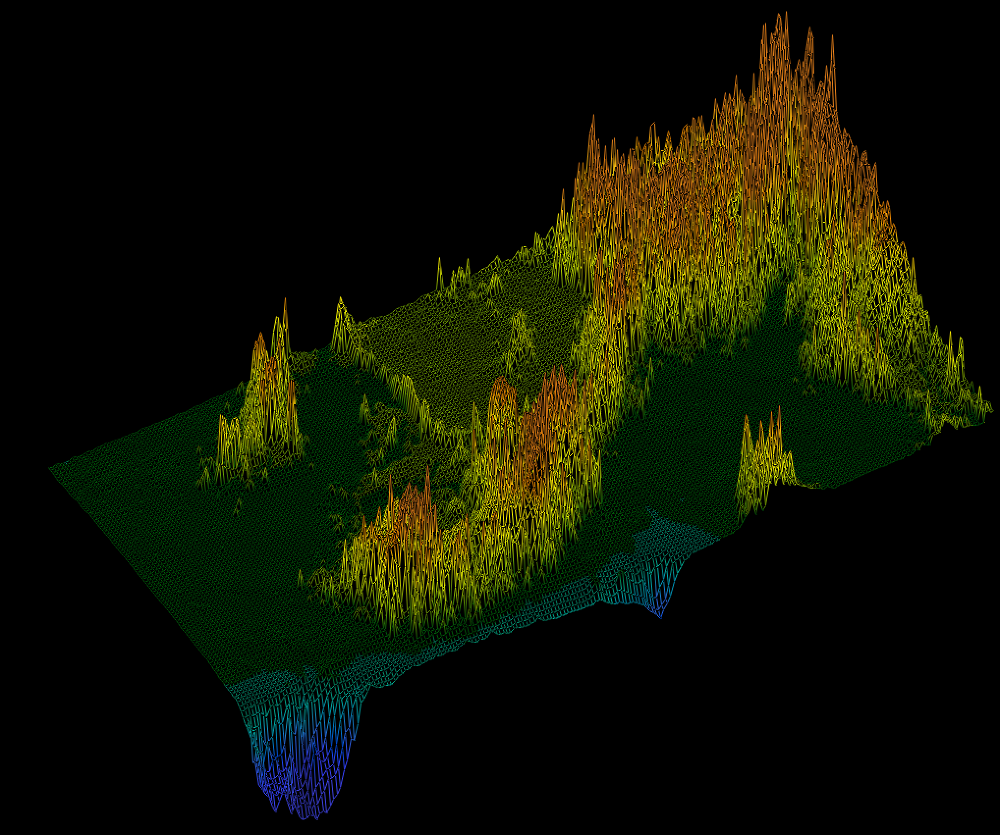

# Fiel de Fier

**About project**

- Lines are drawn using Wu's algorithm
- Linear gradient
- 3D rotation
- Parallel projection
- Zoom
- Reads and applies colors from '.fdf' maps
- Extra window for meme bonus

**FdF manipulations**




<!-- **Vietnam map manipulations + meme bonus**

 -->

---

## Installation

- You have to download Minilibx library to run FdF on your Mac.

### Clone

- Clone this repo to your local machine using `https://github.com/natqegu/fdf.git`

### Setup

> run the project using Makefile feature

```shell
$ make
```

> now you can run executable file 'fdf' with optional map

```shell
$ ./fdf maps/42.fdf
```

> you can clean a workspace of object files, created during compilation

```shell
$ make clean
```

> and also delete every file created during compilation

```shell
$ make fclean
```

---

## FAQ

- **Can I run the project on Windows?**
    - No!
- **Can I create my own maps?**
    - Yes, for that you have to create your own file with '.fdf' extention, or clone Map generator 'https://github.com/jgigault/42MapGenerator.git'.